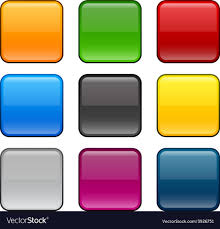

# Square Color Change App

 

      

This simple web application features an impressive effect where a square changes color with a random shadow and background color when hovered over.

## How It Works

1. There is a `
` named `container` in the HTML file (`index.html`). The JavaScript code dynamically adds squares inside this container.

2. The CSS file (`style.css`) determines the overall layout of the page and styles for the squares.

3. The JavaScript file (`app.js`) creates the squares and performs the color change when hovered over.

## Responsive Design and Photo Section

The application is developed with responsive design in mind. Additionally, it includes the following features:

- Responsive design adapting to screen sizes.
- Proper functionality on both mobile devices and desktop browsers.

## Screen to gif

## Live Demo

To see the application in action, click [here](https://square-color-change-app.vercel.app/)

## Requirements

 Compatible with modern web browsers.

## Installation

1. Clone this repository: `git clone repo-link`
2. Navigate to the project directory: `cd project-directory`
3. Open the `index.html` file in a web browser.

## Contributions

We welcome any contributions. Feel free to report issues or submit pull requests.

---
© 2023, Square Color Change App.

